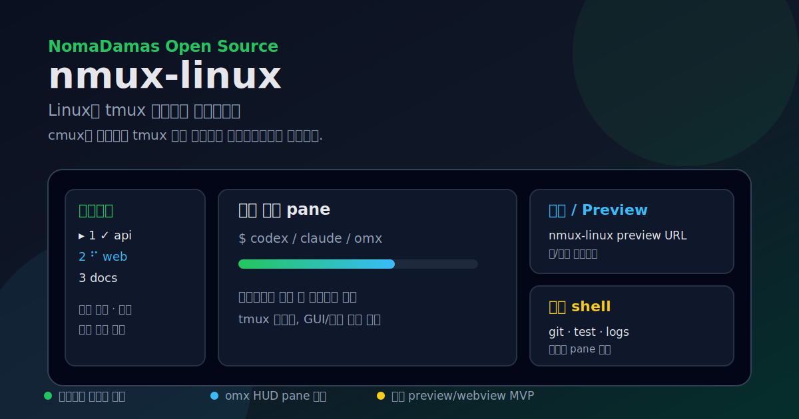

# nmux-linux



**노마다마스 오픈소스 · Linux용 tmux 멀티세션 프론트엔드**

`cmux` 같은 멀티 작업 화면이 Linux에 부족해서 만들었습니다.  
`nmux-linux`는 tmux 한 세션을 프로젝트별 작업 공간으로 바꾸고, 사이드바·메인 pane·오른쪽 보조 pane을 고정된 구조로 관리합니다.

## 핵심 기능

- **프로젝트별 tmux window**: 한 프로젝트를 한 window로 열고 전환합니다.
- **클릭 가능한 사이드바**: 열려 있는 프로젝트, 닫힌 프로젝트, 새 프로젝트를 표시합니다.
- **작업 상태 표시**: 실행 중/완료/실패/입력 필요 상태를 사이드바에 표시합니다.
- **사이드바 깜빡임 완화**: 전체 화면 clear를 줄이고 synchronized output으로 부드럽게 갱신합니다.
- **omx HUD pane 정리**: `omx hud --watch`가 아래 pane을 만들면 `clean-omx-hud`/`fix-layout`으로 정리합니다.
- **오른쪽 preview/webview MVP**: `nmux-linux preview`로 URL, 외부 브라우저, 사용자 명령을 관리 pane에서 실행합니다.
- **상태 저장**: 열려 있던 프로젝트 목록을 저장하고 다음 실행 때 복원합니다.

## 화면 구조

```text
┌──────────────┬──────────────────────────────┬──────────────────┐
│ sidebar      │ main coding pane             │ status / preview │
│ ▸ api   ✓    │ $ codex / claude / omx       ├──────────────────┤
│   web   ⠋    │                              │ shell / logs     │
│   docs       │                              │                  │
└──────────────┴──────────────────────────────┴──────────────────┘
```

## 설치

```bash
git clone https://github.com/NomaDamas/nmux-linux.git
cd nmux-linux
./install.sh
```

필수: Linux, tmux 3.0+, Node.js, bash  
선택: `notify-send`, `paplay`, `w3m`/`lynx`/`elinks`/`links`, `xdg-open`

## 사용법

```bash
nmux-linux                         # 실행/attach
nmux-linux init --force            # 프로젝트 목록 재스캔
nmux-linux open <name|path>        # 프로젝트 열기
nmux-linux close-current           # 현재 프로젝트 닫기
nmux-linux status                  # 세션/pane 상태 보기
nmux-linux fix-layout              # 레이아웃 복구
nmux-linux clean-omx-hud           # omx HUD pane 정리
nmux-linux preview <url>           # 오른쪽 pane에서 URL 미리보기
nmux-linux preview --external <url> # 외부 브라우저로 열기
nmux-linux preview --cmd '<cmd>'   # 오른쪽 pane에서 명령 실행
```

## 통합

- **Claude Code hooks**: 작업 시작/완료/알림 상태를 사이드바에 반영합니다.
- **Codex / omx**: HUD pane 생성을 억제하고, stale HUD pane을 정리합니다.
- **tmux mouse**: 사이드바 클릭으로 window 전환/닫기/열기를 수행합니다.

자세한 내용은 [`doc/INTEGRATIONS.md`](doc/INTEGRATIONS.md)를 참고하세요.

## 패키지 검증

```bash
npm run check
npm test
npm pack
```

## 라이선스

MIT
